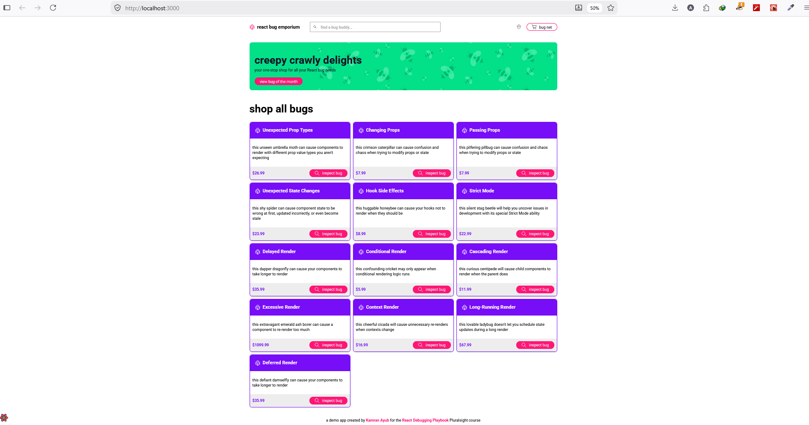

# React Developer Tools Debugging Checkpoint Report

# The objective of this checkpoint was to use React Developer Tools to inspect, debug, and fix issues in a React application involving component state, props, and rendering behavior.

# Process taken
1. Installed React Developer Tools via [React Dev Tools Add-on Mozilla](https://addons.mozilla.org/en-US/firefox/addon/react-devtools/)

2. Run the application via npm run start and it brings up the homepage :

3. Viewed the Component Tree by clicking inspect and clicking on the Component tab :   

# Bug number 1: Unexpected Prop Types
From the bug title, we can already get a hint of the type of bug that is expected which is unexpected prop types. 
Here is a screen shot of the image :
After inspecting using react-dev tools, we can navigate to the component where we can identify the error clearly, which is :
 There are a series of errors: 
 1. Bug 1 - Popularity is not rendering 
            Current code is
            ```ini
            popularity="trending"
            ```

            Correct code is
            ```ini
            popularity={POPULARITY.trending}
            ```
 2. Bug 2 - Rating not rendering
            Current code is 
            ```ini
            rating={0}
            ```
            Current code is
            ```ini
            rating={3.5}
            ```
 3. Bug 3 - Inventory incorrecty displays
            Current code is 
            ```ini
            inventoryCount={null}
            ```
            Correct code is
            ```ini
            inventoryCount={10}
            ```

After the fix, the page renders correctly as so, :


